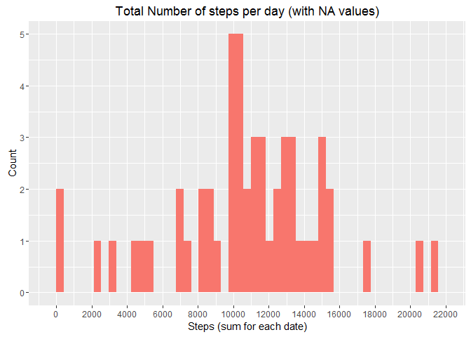
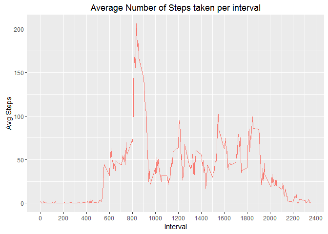
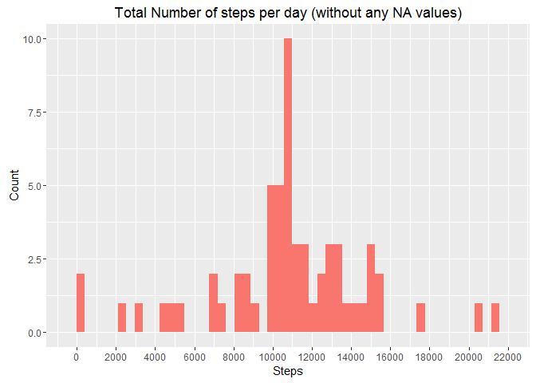
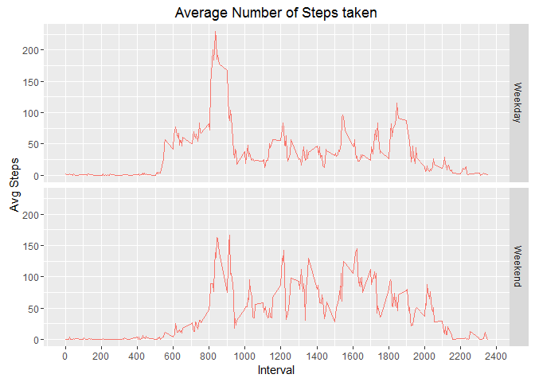

# Reproducible Research: Peer Assessment 1
Nikhil Mohan  
January 28, 2016  


## Loading and preprocessing the data
Unzip the activity.zip file. Loading the data using read.csv function. The date field which is a character on the input file is then converted to a type date using the as.date function.


```r
unzip("./activity.zip")
input.file <- read.csv("./activity.csv")
input.file$date <- as.Date(input.file$date)
str(input.file)
```

```
## 'data.frame':	17568 obs. of  3 variables:
##  $ steps   : int  NA NA NA NA NA NA NA NA NA NA ...
##  $ date    : Date, format: "2012-10-01" "2012-10-01" ...
##  $ interval: int  0 5 10 15 20 25 30 35 40 45 ...
```

## What is mean total number of steps taken per day?
I introduce a function here number_ticks which i will use throughout the project. This function merely takes the limits from the ggplot and splits it to n breakpoints. Then I use the aggregate function to get the sum of steps per date.
I plot the data using ggplot2 and show the summary for the mean and median.

```r
library(ggplot2)
```
#### 1. Calculate the total number of steps taken per day

```r
number_ticks <- function(n) {function(limits) pretty(limits, n)}
steps.per.day <- aggregate(steps~date,data = input.file, sum)
head(steps.per.day)
```

```
##         date steps
## 1 2012-10-02   126
## 2 2012-10-03 11352
## 3 2012-10-04 12116
## 4 2012-10-05 13294
## 5 2012-10-06 15420
## 6 2012-10-07 11015
```
#### 2. Make a histogram of the total number of steps taken each day

```r
## histogram of the total number of steps taken per day
ggplot(steps.per.day, aes(steps, fill = "red"))+geom_histogram(show.legend = FALSE, bins = 50)+scale_x_continuous(breaks=number_ticks(15))+labs(title = "Total Number of steps per day (with NA values)")+xlab("Steps (sum for each date)")+ylab("Count")
```



#### 3. Calculate and report the mean and median of the total number of steps taken per day

```r
summary(steps.per.day$steps)
```

```
##    Min. 1st Qu.  Median    Mean 3rd Qu.    Max. 
##      41    8841   10760   10770   13290   21190
```

## What is the average daily activity pattern?
Using the aggregate function to get the average(mean) of steps per interval. I should get 288 observations here since there are 288 different 5 minute intervals in a day.

```r
avg.steps.per.interval <- aggregate(steps~interval, data = input.file, mean)
str(avg.steps.per.interval)
```

```
## 'data.frame':	288 obs. of  2 variables:
##  $ interval: int  0 5 10 15 20 25 30 35 40 45 ...
##  $ steps   : num  1.717 0.3396 0.1321 0.1509 0.0755 ...
```

#### 1. Make a time series plot (i.e. type = "l") of the 5-minute interval (x-axis) and the average number of steps taken, averaged across all days (y-axis)

```r
ggplot(data = avg.steps.per.interval, aes(interval,steps, col = "red"))+geom_line(stat = "identity", show.legend = FALSE, inherit.aes = TRUE)+labs(title = "Average Number of Steps taken per interval")+ylab("Avg Steps")+xlab("Interval")+scale_x_continuous(breaks=number_ticks(15))
```



#### 2. Which 5-minute interval, on average across all the days in the dataset, contains the maximum number of steps?

```r
subset(avg.steps.per.interval, steps == max(avg.steps.per.interval$steps))
```

```
##     interval    steps
## 104      835 206.1698
```

## Imputing missing values

```r
library(dplyr)
```
I split the main file into 2 - one with only NA for steps and other without.

```r
input.file.withoutNA <- input.file[!is.na(input.file$steps),]
input.file.withNA <- input.file[is.na(input.file$steps),]
```
#### 1. Calculate and report the total number of missing values in the dataset (i.e. the total number of rows with NAs)

```r
nrow(input.file.withNA)
```

```
## [1] 2304
```

#### 2. Devise a strategy for filling in all of the missing values in the dataset. The strategy does not need to be sophisticated. For example, you could use the mean/median for that day, or the mean for that 5-minute interval, etc.
Strategy is to use the mean for the interval to replace the NAs.

```r
input.file.withNA.Replaced <- mutate(input.file.withNA, steps = sapply(input.file.withNA$interval, function (x) {mean(input.file[input.file$interval==x,1],na.rm = TRUE )}))
```
#### 3. Create a new dataset that is equal to the original dataset but with the missing data filled in.

```r
input.file.new <- rbind(input.file.withNA.Replaced,input.file.withoutNA)
str(input.file.new)
```

```
## 'data.frame':	17568 obs. of  3 variables:
##  $ steps   : num  1.717 0.3396 0.1321 0.1509 0.0755 ...
##  $ date    : Date, format: "2012-10-01" "2012-10-01" ...
##  $ interval: int  0 5 10 15 20 25 30 35 40 45 ...
```
#### 4. Make a histogram of the total number of steps taken each day and Calculate and report the mean and median total number of steps taken per day. Do these values differ from the estimates from the first part of the assignment? What is the impact of imputing missing data on the estimates of the total daily number of steps?

```r
## getting aggregate with total number of steps per day
steps.per.day.withoutNA <- aggregate(steps~date,data = input.file.new, sum)
## histogram of the total number of steps taken per day
ggplot(steps.per.day.withoutNA, aes(steps, fill = "red"))+geom_histogram(show.legend = FALSE, bins = 50)+scale_x_continuous(breaks=number_ticks(15))+labs(title = "Total Number of steps per day (without any NA values)")+xlab("Steps")+ylab("Count")
```



```r
summary(steps.per.day.withoutNA$steps)
```

```
##    Min. 1st Qu.  Median    Mean 3rd Qu.    Max. 
##      41    9819   10770   10770   12810   21190
```

## Are there differences in activity patterns between weekdays and weekends?
#### 1. Create a new factor variable in the dataset with two levels - "weekday" and "weekend" indicating whether a given date is a weekday or weekend day.

```r
input.file.new.day <- mutate(input.file.new, wday = sapply(weekdays(input.file.new$date), function (x1) {if(grepl('^S.*', x1)) {'Weekend'} else {'Weekday'}}))
input.file.new.day$wday <- as.factor(input.file.new.day$wday)
str(input.file.new.day)
```

```
## 'data.frame':	17568 obs. of  4 variables:
##  $ steps   : num  1.717 0.3396 0.1321 0.1509 0.0755 ...
##  $ date    : Date, format: "2012-10-01" "2012-10-01" ...
##  $ interval: int  0 5 10 15 20 25 30 35 40 45 ...
##  $ wday    : Factor w/ 2 levels "Weekday","Weekend": 1 1 1 1 1 1 1 1 1 1 ...
```
#### 2. Make a panel plot containing a time series plot (i.e. type = "l") of the 5-minute interval (x-axis) and the average number of steps taken, averaged across all weekday days or weekend days (y-axis). See the README file in the GitHub repository to see an example of what this plot should look like using simulated data.

```r
avg.steps.per.interval.wday <- aggregate(steps~interval+wday, data = input.file.new.day, mean)
ggplot(data = avg.steps.per.interval.wday, aes(interval,steps, col = "red"))+geom_line(stat = "identity", show.legend = FALSE, inherit.aes = TRUE)+facet_grid(wday~.)+labs(title = "Average Number of Steps taken")+ylab("Avg Steps")+xlab("Interval")+scale_x_continuous(breaks=number_ticks(15))
```


